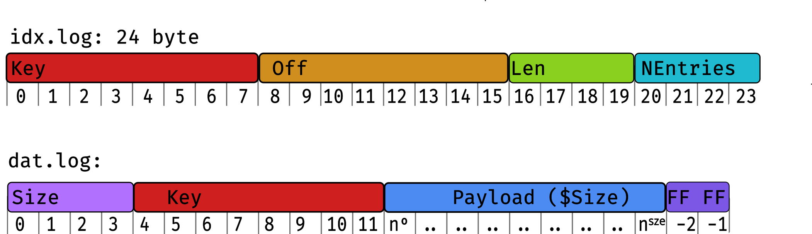

# ``timeq``

[](https://godoc.org/github.com/sahib/timeq)


A file-based priority queue in Go.

Generally speaking, `timeq` can be used to implement these and more:

- A streaming platform like [NATS](https://nats.io) or message brokers similar to [Mosquitto](https://mosquitto.org).
- A file-backend job queue with different priorities.
- A telemetry pipeline for IoT devices to buffer offline data.
- Wherever you would use a regular file-based queue.

## Features

- Clean and well test code base based on Go 1.22
- High throughput thanks to batch processing and `mmap()`
- Tiny memory footprint that does not depend on the number of items in the queue.
- Simple interface with classic `Push()` and `Read()` and only few other functions.
- Sane default settings, with some knobs that can be tuned for your use case.
- Consuming end can be efficiently and easily forked into several consumers.

This implementation should be generally useful, despite the ``time`` in the
name. However, the initial design had timestamps as priority keys in mind. For
best performance the following assumptions were made:

- Your OS supports `mmap()` and `mremap()` (i.e. Linux/FreeBSD)
- Seeking in files during reading is cheap (i.e. no HDD)
- The priority key ideally increases without much duplicates (like timestamps, see [FAQ](#FAQ)).
- You push and pop your data in, ideally, big batches.
- The underlying storage has a low risk for write errors or bit flips.
- You trust your data to some random dude's code on the internet (don't we all?).

If some of those assumptions do not fit your use case and you still managed to make it work,
I would be happy for some feedback or even pull requests to improve the general usability.

See the [API documentation here](https://godoc.org/github.com/sahib/timeq) for
examples and the actual documentation.

## Use cases

My primary use case was a embedded Linux device that has different services that generate
a stream of data that needs to be send to the cloud. For this the data was required to be
in ascending order (sorted by time) and also needed to be buffered with tight memory boundaries.

A previous attempt based on``sqlite3`` did work kinda well but was much slower
than it had to be (partly also due to the heavy cost of ``cgo``). This motivated me to
write this queue implementation.

## Usage

To download the library, just do this in your project:

```bash
# Use latest or a specific tag as you like
$ go get github.com/sahib/timeq@latest
```

We also ship a rudimentary command-line client that can be used for experiments.
You can install it like this:

```bash
$ go install github.com/sahib/timeq/cmd@latest
```

## Benchmarks

The [included benchmark](https://github.com/sahib/timeq/blob/main/bench_test.go#L15) pushes 2000 items with a payload of 40 byte per operation.

```
$ make bench
goos: linux
goarch: amd64
pkg: github.com/sahib/timeq
cpu: 12th Gen Intel(R) Core(TM) i7-1270P
BenchmarkPopSyncNone-16      35924  33738 ns/op  240 B/op  5 allocs/op
BenchmarkPopSyncData-16      35286  33938 ns/op  240 B/op  5 allocs/op
BenchmarkPopSyncIndex-16     34030  34003 ns/op  240 B/op  5 allocs/op
BenchmarkPopSyncFull-16      35170  33592 ns/op  240 B/op  5 allocs/op
BenchmarkPushSyncNone-16     20336  56867 ns/op   72 B/op  2 allocs/op
BenchmarkPushSyncData-16     20630  58613 ns/op   72 B/op  2 allocs/op
BenchmarkPushSyncIndex-16    20684  58782 ns/op   72 B/op  2 allocs/op
BenchmarkPushSyncFull-16     19994  59491 ns/op   72 B/op  2 allocs/op
```

## Multi Consumer

`timeq` supports a `Fork()` operation that splits the consuming end of a queue
in two halves. You can then consume from each of the halves individually,
without modifying the state of the other one. It's even possible to fork a fork
again, resulting  in a consumer hierarchy. This is probably best explained by
this diagram:


1. The initial state of the queue with 10 items in it,
2. We fork the queue by calling `Fork("foo")`.
3. We consume 5 items from the fork via `fork.Pop()`.
4. Pushing new data will go to all existing forks.

This is implemented efficiently (see below) by just having duplicated indexes.
It opens up some interesting use cases:

- For load-balancing purposes you could have several workers consuming data from `timeq`, each `Pop()`'ing
  and working on different parts of the queue. Sometimes it would be nice to let workers work on the same
  set of data (e.g. when they all transform the data in different ways). The latter is easily possibly with forks.
- Fork the queue and consume from it until some point as experiment and remove the fork afterwards. The original
  data is not affected by this.
- Prevent data from data getting lost by keeping a "deadletter" fork that keeps track of whatever you want. This way
  you can implement something like a `max-age` of queue's items.

## Design

* All data is divided into buckets by a user-defined function (»`BucketFunc`«).
* Each bucket is it's own priority queue, responsible for a part of the key space.
* A push to a bucket writes the batch of data to a memory-mapped log
  file on disk. The location of the batch is stored in an
  in-memory index and to a index WAL.
* On pop we select the bucket with the lowest key first and ask the index to give
  us the location of the lowest batch. Once done the index is updated to mark the
  items as popped. The data stays intact in the data log.
* Once a bucket was completely drained it is removed from disk to retain space.

Since the index is quite small (only one entry per batch) we can easily fit it in memory.
On the initial load all bucket indexes are loaded, but no memory is mapped yet.

### Limits

* Each item payload might be at most 64M.
* Each bucket can be at most 2^63 bytes in size.
* Using priority keys close to the integer limits is most certainly a bad idea.
* When a bucket was created with a specific `BucketFunc` it cannot be changed later.
  `timeq` will error out in this case and the queue needs to be migrated.
  If this turns out as a practical issue we could implement an automated migration path.

### Data Layout

The data is stored on disk in two files per bucket:

* ``data.log``: Stores a single entry of a batch.
* ``idx.log``: Stores the key and location of batches. Can be regenerated from ``dat.log``.

This graphic shows one entry of each:



Each bucket lives in its own directory called `K<key>`.
Example: If you have two buckets, your data looks like this on this:

```
/path/to/db/
├── K00000000000000000001
│   ├── dat.log
│   ├── idx.log
│   └── forkx.idx.log
└── K00000000000000000002
    ├── dat.log
    ├── idx.log
    └── forkx.idx.log
```

The actual data is in `dat.log`. This is an append-only log that is
memory-mapped by `timeq`. All files that end with `idx.log` are indexes, that
point to the currently reachable parts of `dat.log`. Each entry in `idx.log` is
a batch, so the log will only increase marginally if your batches are big
enough. `forkx.idx.log` (and possibly more files like that) are index forks,
which work the same way as `idx.log`, but track a different state of the respective bucket.

NOTE: Buckets get cleaned up on open or when completely empty (i.e. all forks
are empty) during consumption. Do not expect that the disk usage automatically
decreases whenever you pop something. It does decrease, but in batches.

### Applied Optimizations

* Data is pushed and popped as big batches and the index only tracks batches.
  This greatly lowers the memory usage, if you use big batches.
* The API is very friendly towards re-using memory internally. Data is directly
  sliced from the memory map and given to the user in the read callback. Almost
  no allocations made during normal operation. If you need the data outside the callback,
  you have the option to copy it.
* Division into small, manageable buckets. Only the buckets that are accessed are actually loaded.
* Both `dat.log` and `idx.log` are append-only, requiring no random seeking for best performance.
* ``dat.log`` is memory mapped and resized using `mremap()` in big batches. The bigger the log, the bigger the pre-allocation.
* Sorting into buckets during `Push()` uses binary search for fast sorting.
* `Shovel()` can move whole bucket directories, if possible.
* In general, the concept of »Mechanical Sympathy« was applied to some extent to make the code cache friendly.

## FAQ:

### Can timeq be also used with non-time based keys?

There are no notable places where the key of an item is actually assumed to be
timestamp, except for the default bucket func (which can be configured). If you
find a good way to sort your data into buckets you should be good to go. Keep
in mind that timestamps were the idea behind the original design, so your
mileage may vary - always benchmark your individual usecase. You can modify one
of the existing benchmarks to test your assumptions.

### Why should I care about buckets?

Most importantly: Only buckets are loaded which are being in use.
This allows a very small footprint, especially if the push input is already roughly sorted.

There are also some other reasons:

* If one bucket becomes corrupt for some reason, you loose only the data in this bucket.
* On ``Shovel()`` we can cheaply move buckets if they do not exist in the destination.
* ...and some more optimizations.

### How do I choose the right size of my buckets?

It depends on a few things. Answer the following questions in a worst case scenario:

- How much memory do you have at hand?
- How many items would you push to a single bucket?
- How big is each item?
- How many buckets should be open at the same time?

As `timeq` uses `mmap(2)` internally, only the pages that were accessed are
actually mapped to physical memory. However when pushing a lot of data this is
mapped to physical memory, as all accessed pages of a bucket stay open (which is
good if you Pop immediately after). So you should be fine if this evaluates to true:

`BytesPerItem * ItemsPerBucketInWorstCase * MaxOpenParallelBuckets < BytesMemoryAvailable - WiggleRoom`.

You can lower the number of open buckets with `MaxOpenParallelBuckets`.

Keep in mind that `timeq` is fast and can be memory-efficient if used correctly,
but it's not a magic device. In future I might introduce a feature that does not
keep the full bucket mapped if it's only being pushed to. The return-on-invest
for such an optimization would be rather small though.

### Can I store more than one value per key?

Yes, no problem. The index may store more than one batch per key. There is a
slight allocation overhead on ``Queue.Push()`` though. Since ``timeq`` was
mostly optimized for mostly-unique keys (i.e. timestamps) you might see better
performance with less duplicates. It should not be very significant though.

If you want to use priority keys that are in a very narrow range (thus many
duplicates) then you can think about spreading the range a bit wider.

For example: You have priority keys from zero to ten for the tasks in your job
queue. Instead of using zero to ten as keys, you can add the job-id to the key
and shift the priority: ``(prio << 32) | jobID``.

### How failsafe is ``timeq``?

I use it on a big fleet of embedded devices in the field, so it's already quite
a bit battle tested. Design wise, damaged index files can be regenerated from
the data log. There's no error correction code applied in the data log and no
checksums are currently written. If you need this, I'm happy if a PR comes in
that enables it optionally.

For durability, the design is build to survive crashes without data loss (Push,
Read) but, in some cases, it might result in duplicated data (Shovel). My
recommendation is **designing your application logic in a way that allows
duplicate items to be handled gracefully**.

This assumes a filesystem with full journaling (``data=journal`` for ext4) or
some other filesystem that gives your similar guarantees. We do properly call
`msync()` and `fsync()` in the relevant cases. For now, crash safety was not
yet tested a lot though. Help here is welcome.

The test suite is currently roughly as big as the codebase. The best protection
against bugs is a small code base, so that's not too impressive yet. We're of
course working on improving the testsuite, which is a never ending task.
Additionally we have a bunch of benchmarks and fuzzing tests.

### Is `timeq` safely usable from several go-routines?

Yes. There is no real speed benefit from doing so though currently,
as the current locking strategy prohibits parallel pushes and reads.
Future releases might improve on this.

## License

Source code is available under the MIT [License](/LICENSE).

## Contact

Chris Pahl [@sahib](https://github.com/sahib)

## TODO List

- [ ] Test crash safety in automated way.
- [ ] Check for integer overflows.
- [ ] Have locking strategy that allows more parallelism.
